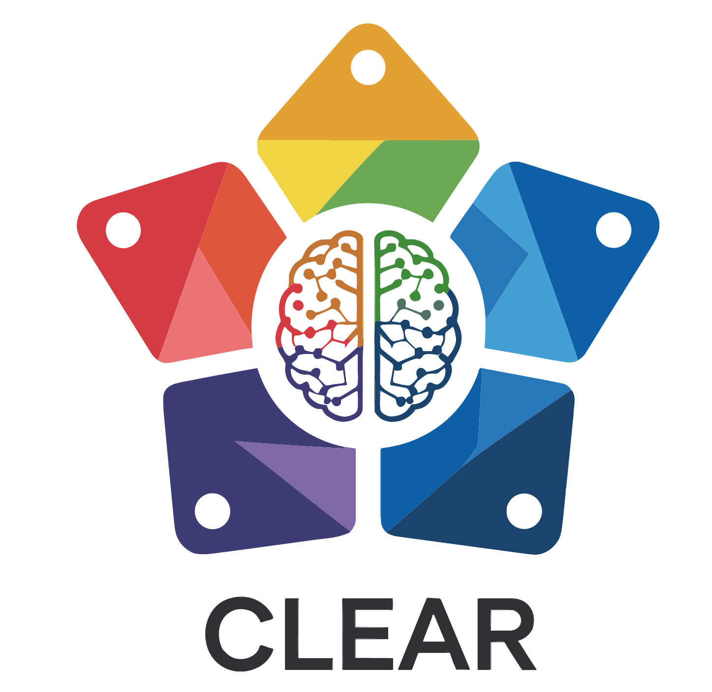
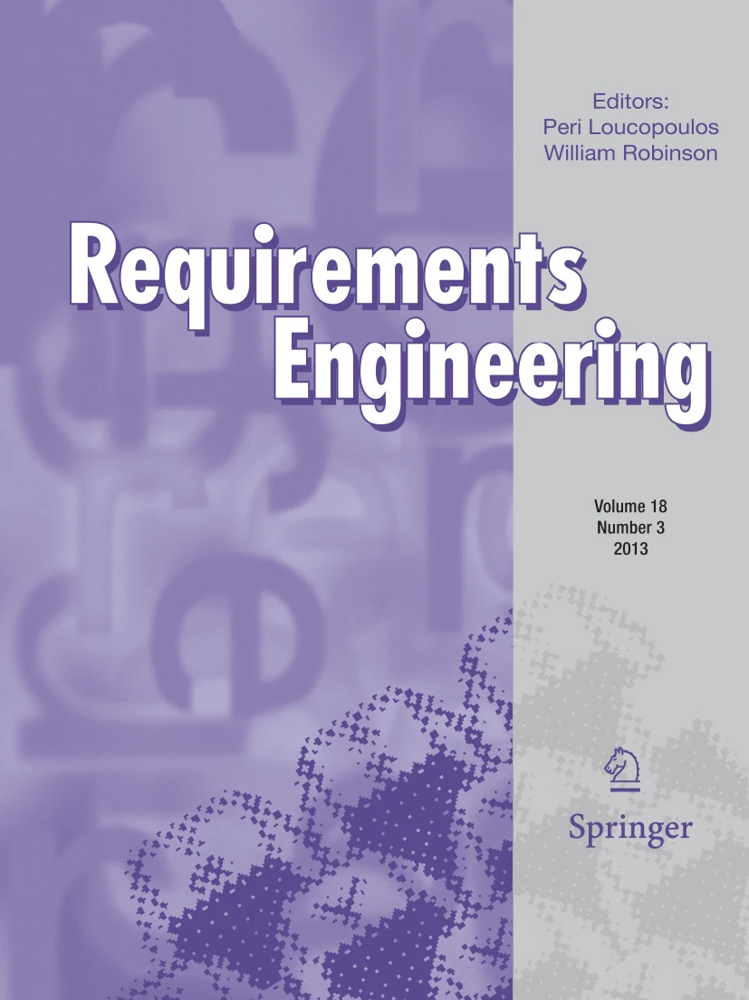
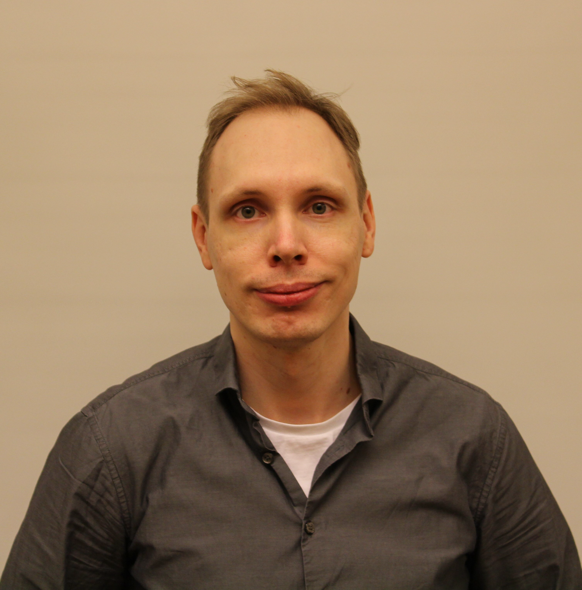

*Navigate to:* [**SiREN main page**](..), [**Past Signal 2025**](../2025)

## Welcome to SiREN Signal 2026 May 27-28 in Västerås!

SiREN brings together junior and senior researchers as well as practitioners working in requirements engineering in our annual meeting to foster exchange and collaboration. 
We are happy to announce that this year, the meeting is sponsored by [RISE Research Institutes of Sweden](http://ri.se/) and the [ITEA CLEAR Project](https://itea4.org/project/clear.html).

The meeting is proudly organized by [Senior Lecturer Luciana Provenzano](https://www.es.mdu.se/staff/2958-Luciana_Provenzano), [Dr Abbas Khan](https://www.ri.se/sv/person/abbas-khan), and [Dr Julian Frattini](https://julianfrattini.github.io/)

### Overview

Signal 2026 will take place on **May 27-28, 2026** (lunch-to-lunch) at **Mälardalen University, Västerås**.
On both days, we meet in room Ypsilon (description of how to find the room [here](../img/Signal26%20Room%20Finder.pdf)).
Participants are responsible for their own travel and accommodation cost.
Lunch and fika will be provided by our generous sponsors.
For questions on local arrangements for Signal 2026, contact [Luciana Provenzano](https://www.es.mdu.se/staff/2958-Luciana_Provenzano).

#### Guest Appearance by Fabiano Dalpiaz

We are particularly excited to announce that the new **editor-in-chief of the Requirements Engineering journal**, Professor [Fabiano Dalpiaz](https://www.uu.nl/staff/FDalpiaz) from the Utrecht University, will join us in an online session.
In this session, he will explain the journal publication process to new requirements engineering researchers, present his vision for the journal, and be open to discuss the future of requirements engineering research. Join the session and [submit to the RE journal here](https://link.springer.com/journal/766).

#### Industry Keynote by Pontus Jernberg

Pontus Jernberg is a train brakes control engineer and Senior Expert in software engineering at ALSTOM. Over more than a decade with the company, he has worked across most phases of the development life cycle, including:
Business case analysis and system concept development, hazard analysis and system requirements engineering, system and software architecture and design, software, system, and integration verification and validation, system commissioning, and reliability growth and improvement phases. 

He has contributed to both delivery projects and product/platform development. Throughout his career, he has maintained a strong interest in improving development processes, which has led him to Agile development, Model-Based Engineering, and participation in several pilot and prototype initiatives. With the emergence of AI and ML, he is keen to explore how these technologies can further enhance existing development paradigms.

### Program

We are happy to announce the following program for the meeting.

#### Day 1: May 27th, 2026

| Time | Speaker(s) | Title |
|---|---|---|
| 12:15 - 13:00 | | Joint Lunch |
| 13:00 - 13:15 | Organizing committee | Welcome to SiREN Signal 2026 |
| 13:15 - 13:30 | Node representatives | Update of each node representative |
| 13:30 - 13:50 | Sofia Ouhbi | Quality in Use Matters in Requirements Engineering |
| 13:50 - 14:10 | Panagiota Chatzipetrou | Consistency of GPT Models in Classifying Natural Language Requirements |
| 14:10 - 14:30 | Romina Spalazzese | On the Needs for Intelligent and Trustworthy IoT Systems |
| 14:30 - 15:00 | | ☕ Coffee Break  |
| 15:00 - 15:20 | Eduard Paul Enoiu | From Requirements Traceability to Test Design Argumentation |
| 15:20 - 15:50 | Eric Knauss | Annotation Requirements to Annotation Errors & (Continuous) Compliance as a Traceability Problem |
| 15:50 - 16:10 | Luciana Provenzano | How do practitioners reason about security requirements? An Interview study. |
| 16:15 - 17:00 | | **Panel Discussion**: The Future of Requirements Engineering Research |

We will have a joint dinner at [Bistro Gränden](https://www.bistrogranden.se/) at 18:30.
The dinner is self-paid. The [open SC meeting](#open-sc-meeting) will take place during the dinner.

#### Day 2: May 28th, 2026

| Time | Speaker(s) | Title |
|---|---|---|
| 08:30 - 09:15 | Fabiano Dalpiaz | **Guest session**: Meet the new editor-in-chief of the [Requirements Engineering journal](https://link.springer.com/journal/766) |
| 09:15 - 09:45 | Adelen Festin | Enterprise Architecture: an enabler for simulation-capable DT for organizational decision making |
| 09:45 - 10:00 | Julian Frattini | Information is all you need: Requirements Engineering Quality Reframed |
| 10:00 - 10:30 | | ☕ Coffee Break |  
| 10:30 - 11:00 | Pontus Jernberg | **Industry keynote**: Practical Requirements Modeling |
| 11:00 - 11:45 | Markus Borg | Guiding AI Agents to generate Code that fits the Human Brain: Maintainability Requirements on Code |
| 11:45 - 12:00 | Organizing committee | Collecting feedback, announcing Signal 2027, and wrap-up |
| 12:00 - 13:00 | | Joint Lunch |

Please note that the program may be subject to change.
In case of any questions, please reach out to the organizing committee.

#### Open SC meeting

During the dinner we will have a short (approx. 15 min) open Steering Committee (SC) meeting, chaired by the current SC Chair (SCC, Björn Regnell) with this tenative agenda:

* Enumerate voting members: 
  - BR LP JF EK MB RS GK PC
* Finalize agenda
* Decision on next SiGNAL and SPC. 
  - proposal: 2027 Örebro, Docent Panagiota Chatzipetrou
  - proposal: 2028 Malmö, Docent Romina Spalazzese
* Decision on new node and NR:
  - proposal: Uppsala is included as a new node
  - proposal: [Assoc. Prof. Sofia Ouhbi](https://www.uu.se/en/contact-and-organisation/staff?query=N22-2414) is appointed as Node Representative of Uppsala
* Decision on SCC for next 2 years (until Signal 2028)
  - proposal: Prof. Bjorn Regnell
* Any Other Business
